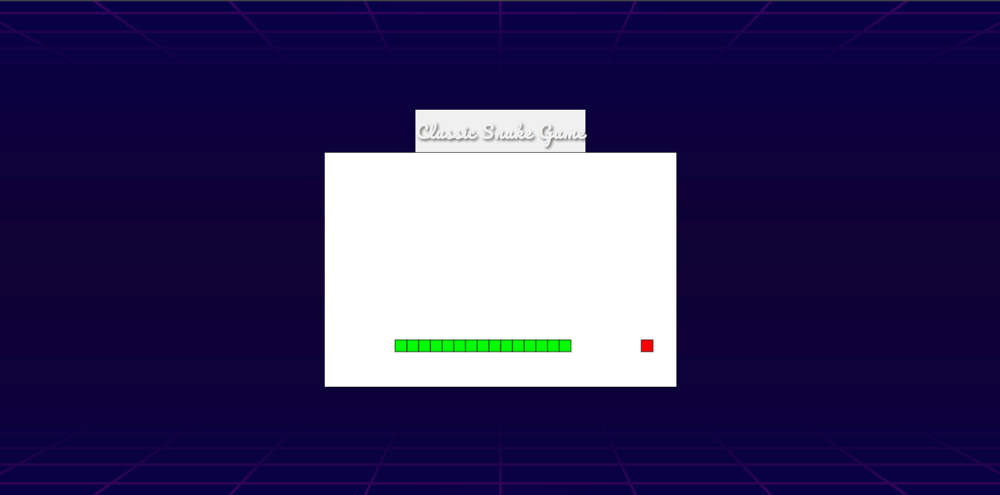

# 🐍 Classic Snake Game

This is a web-based version of the classic Snake game built using **HTML**, **CSS**, and **JavaScript**. The game runs in the browser and features smooth controls, collision detection, and an appealing retro-style interface.

## 🎮 How to Play

- Use the **Arrow Keys** on your keyboard to control the direction of the snake:
  - `↑` Up
  - `↓` Down
  - `←` Left
  - `→` Right
- The objective is to eat the red squares (food) to grow the snake.
- If the snake collides with itself, it resets to the initial state.

## 📁 Project Structure

```
📦 SnakeGame/
├── snake.html         # Main HTML file to load the game
├── styles.css         # CSS file for styling
├── script.js          # JavaScript file that contains game logic
```

## 🖼️ Features

- Responsive game canvas (600x400)
- Custom background image for game area and title bar
- Smooth snake movement and collision detection
- Reset functionality on collision
- Classic arcade-style design with modern CSS styling

## 🚀 Getting Started

1. Clone the repository or download the files.
2. Open `snake.html` in any modern web browser.
3. Start playing!

## 📷 Screenshots



## 🛠️ Technologies Used

- HTML5 `<canvas>`
- CSS3 (including Google Fonts and background images)
- Vanilla JavaScript

## 📄 License

This project is open-source and free to use. Attribution is appreciated.

---

Enjoy the game and feel free to modify it!
